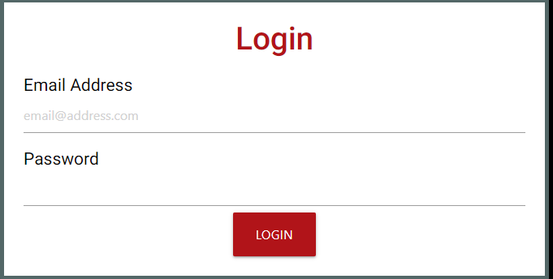

# Muscle Metrics
Welcome to Muscle Metrics. This website offers a personalized dashboard that allows you to track and celebrate weightlifting milestones, visualize progress with charts, and manage workout sessions with detailed logs. With a responsive, mobile-friendly interface, this website keeps you engaged with your fitness goals anytime, anywhere.                                            

***
**Contents**
- [Muscle Metrics](#muscle-metrics)
  - [User Stories](#user-stories)
      - [As A New User:](#as-a-new-user)
      - [As A Returning User:](#as-a-returning-user)
      - [As A Returning User - Future Functionality:](#as-a-returning-user---future-functionality)
  - [Features](#features)
    - [Existing Features:](#existing-features)
      - [User-Centric Dashboard](#user-centric-dashboard)
        - [Exercise Chart Visualization  *(See figure 1 below)*](#exercise-chart-visualization--see-figure-1-below)
      - [Workout Session Management](#workout-session-management)
        - [Detailed Workout Logs *(See figure 2 below)*](#detailed-workout-logs-see-figure-2-below)
        - [Exercise Record *(See figure 2 \& 3 below)*](#exercise-record-see-figure-2--3-below)
      - [Account Management](#account-management)
        - [Secure Login System *(See figure 4 below)*](#secure-login-system-see-figure-4-below)
      - [Responsive Design](#responsive-design)
        - [Mobile-Friendly Interface](#mobile-friendly-interface)
    - [Future Features:](#future-features)
      - [Advanced Analytics](#advanced-analytics)
        - [Predictive Performance Trends](#predictive-performance-trends)
        - [Muscle Group Analytics](#muscle-group-analytics)
      - [Social Integration](#social-integration)
        - [Community Challenges](#community-challenges)
        - [Workout Partner Matching](#workout-partner-matching)
      - [Personalization](#personalization)
        - [Customizable Workout Plans](#customizable-workout-plans)
        - [Virtual Personal Trainer](#virtual-personal-trainer)
      - [Health Ecosystem Integration](#health-ecosystem-integration)
        - [Wearable Device Syncing](#wearable-device-syncing)
        - [Health App Data Import](#health-app-data-import)
      - [Motivational Insights](#motivational-insights)
        - [Achievement Notifications](#achievement-notifications)
  - [Wireframes](#wireframes)
  - [Design](#design)
    - [Overview](#overview)
    - [Typography](#typography)
    - [Color Palette](#color-palette)
    - [Framework](#framework)
    - [Features and Design](#features-and-design)
    - [Usage of Design Elements](#usage-of-design-elements)
    - [Accessibility](#accessibility)
    - [Conclusion](#conclusion)
  - [CRUD Functionality](#crud-functionality)
    - [Overview](#overview-1)
    - [Sign-Up Process](#sign-up-process)
    - [Logging and Viewing Exercises](#logging-and-viewing-exercises)
    - [Conclusion](#conclusion-1)
  - [Technology](#technology)
    - [Languages  Used](#languages--used)
    - [Frameworks](#frameworks)
    - [Libraries](#libraries)
    - [Templating Engine](#templating-engine)
    - [Utilities Used](#utilities-used)
    - [Services](#services)
  - [Testing](#testing)

***
## User Stories
#### As A New User:
1. I would like to be able to easily record my weightlifting achievements, so that I can see a comprehensive display of my personal records and feel a sense of progress and accomplishment.
2. I would like an intuitive way to visualize my strength training journey, so that I can monitor my progress over time through charts that reflect my workout history.
3. I would like a systematic approach to manage my workout sessions, where I can log exercises, weight lifted, sets, and reps in an organized manner to keep track of my daily fitness routine.
4. I would like full control over my exercise records with the ability to create, read, update, and delete entries, so I can manage my fitness data effectively.
5. I would like a secure login system for my fitness app, so that I can be assured my personal fitness data remains private and secure.
6. I would like a mobile-friendly interface for my fitness app that adapts to various devices, allowing me to log workouts whether I’m at home or on-the-go.
#### As A Returning User:
1. I would like to quickly access my Personal Best Tracker to update new milestones, reinforcing my long-term commitment to weightlifting and celebrating my progress.
2. I would like to see my strength progression through updated charts each time I log in, allowing me to adjust my training program based on past performance and future goals.
3. I would like to efficiently enter and review my workout logs from previous sessions, ensuring consistency is maintained.
4. I would like the ability to edit and refine my exercise records over time, utilizing the CRUD functionalities to reflect changes in my fitness routine and ensure my data remains accurate.
5. I would like to access my dashboard quickly, utilizing the secure login system that protects my privacy.
6. I would like seamless integration across my devices when using the fitness app, so I can transition from logging workouts on my phone to reviewing progress on my tablet or desktop without any inconvenience.
#### As A Returning User - Future Functionality:
1. I would like the app to analyze my past workout performance and provide predictions on when I might hit a plateau, so that I can adjust my workout routine in advance to avoid stagnation.
2. I would like to to participate in community challenges and compare my progress on leader boards, so I can stay motivated and socially engaged with the Muscle Metrics community.
3. I would like to connect with workout partners who share similar goals and schedules, so I can have a more consistent and motivating workout experience.
4. I would like the app to create a personalized workout plan that adapts to my progress and feedback, so I can efficiently achieve my fitness goals despite a changing schedule.
5. I would like to sync my wearable devices with the app to track my heart rate and calories burned for a comprehensive view of my health.
6. I would like to operate the fitness app hands-free while working out, so I can log my exercises and navigate the app without interruption.
7. I would like to log my meals and track my macro intake according to my workout goals, so I can better align my nutrition with my fitness objectives.
***
## Features
This project is designed to provide an informative and useful resource to weight lifters and gym goers.
### Existing Features:
#### User-Centric Dashboard
##### Exercise Chart Visualization  *(See figure 1 below)* 
- Monitor your strength journey with intuitive charts that reflect your workout history over time. 
#### Workout Session Management
##### Detailed Workout Logs *(See figure 2 below)*
- Input the data of every workout: exercises, weights, sets, and reps in an organized and efficient manner. 
##### Exercise Record *(See figure 2 & 3 below)*
- Full control over your fitness data through Create, Read, Update, and Delete (CRUD) functionalities for your exercise records. 
#### Account Management
##### Secure Login System *(See figure 4 below)*
- Access your personal dashboard securely with a dedicated login page, ensuring your fitness data is personal and private. 
#### Responsive Design
##### Mobile-Friendly Interface
- Stay connected to your goals with a design that adapts to your mobile, tablet, or desktop devices for logging workouts on-the-go. *(See Responsiveness section within the testing document)*                                    
                                                          
- Figure 1  
             
- Figure 2

- Figure 3

- Figure 4

### Future Features:
#### Advanced Analytics
##### Predictive Performance Trends
- Use machine learning algorithms to predict future performance and plateaus based on past workout data.
##### Muscle Group Analytics
- Detailed reports on muscle group engagement and recommended workouts to optimize muscle symmetry and performance.
#### Social Integration
##### Community Challenges
- Engage with the Muscle Metrics community through challenges, leader boards, and social sharing features.
##### Workout Partner Matching
- Connect with workout partners who have similar goals and workout schedules to stay motivated.
#### Personalization
##### Customizable Workout Plans
- Introduce AI-driven customizable workout plans that adapt to user's progress and feedback.
##### Virtual Personal Trainer
- A virtual coach feature providing form tips, workout suggestions, and real-time feedback.
#### Health Ecosystem Integration
##### Wearable Device Syncing
- Sync with various wearable devices to include heart rate, calories burned, and activity levels for a holistic health view.
##### Health App Data Import
- Import data from other health applications to centralize all fitness and health information on one platform.
#### Motivational Insights
##### Achievement Notifications
- Get instant gratification with alerts and badges when you hit new achievements or surpass your personal bests.
***
## Wireframes
[Mobile Homepage](resources/wireframes/mobile_home.PNG)                 
[Mobile Login Page](resources/wireframes/mobile_login.PNG)                    
[Mobile Register Page](resources/wireframes/mobile_register.PNG)                                          
[Mobile Profile Page](resources/wireframes/mobile_profile.PNG)                                 
[Mobile Log Exercises Page](resources/wireframes/mobile_log_exercise.PNG)                         
[Mobile Dashboard Page](resources/wireframes/tablet_dashboard.PNG)                      
[Tablet Homepage](resources/wireframes/tablet_home.PNG)                             
[Tablet Login Page](resources/wireframes/tablet_login.PNG)                          
[Tablet Register Page](resources/wireframes/tablet_register.PNG)                              
[Tablet Profile Page](resources/wireframes/tablet_profile.PNG)                        
[Tablet Log Exercises Page](resources/wireframes/tablet_log_exercises.PNG)                                 
[Tablet Dashboard Page](resources/wireframes/tablet_dashboard.PNG)                                    
[Desktop Homepage](resources/wireframes/desktop_home.PNG)                                       
[Desktop Login Page](resources/wireframes/desktop_login.PNG)                                      
[Desktop Register Page](resources/wireframes/desktop_register.PNG)                                        
[Desktop Profile Page](resources/wireframes/desktop_profile.PNG)                                  
[Desktop Log Exercises Page](resources/wireframes/desktop_log_exercises.PNG)                                    
[Desktop Dashboard Page](resources/wireframes/desktop_dashboard.PNG)                                      
***
## Design
### Overview
Muscle Metrics is designed to offer a user-friendly and visually appealing website tailored for fitness enthusiasts to effectively track and manage their workout progress. The design blends modern aesthetics with practical functionality, creating an engaging and efficient user experience.                                                
### Typography
- **Headings**: Oswald, sourced from Google Fonts, gives a modern and strong character to headings, capturing the user's attention and guiding them through different sections.
- **Text**: Roboto, with sans-serif as the fallback, provides excellent readability for detailed information, ensuring that text is legible across devices and resolutions.                                              

                   
               
### Color Palette
- **Primary Background**: `#010101` - A deep black for a powerful and elegant backdrop that highlights content.
- **Secondary Background**: `#CCCCCC` - A light grey for card backgrounds or secondary elements, providing a soft contrast.
- **Accent Colour**: `#B11419` - A strong red to call attention to critical elements like alerts or buttons.
- **Text Colour**: `#FFFFFF` - Pure white for primary content, offering maximum contrast for readability.
- **Modal Colour**: `#8BC34A` - A vibrant green for pop up elements, invoking a sense of activity and progress.                                        
- **Modal Colour**:`#E53935` - A vibrant red for error pop up elements, giving a sense of danger.

### Framework
- **Materialize**: A modern responsive front-end framework based on Material Design principles, enabling me to create a consistent visual and interactive user experience.
### Features and Design         
- **User-Centric Dashboard**: A dark-themed dashboard with cards outlined in `#536767` to categorize the different sections.     
- **Progress Chart Visualization**: Pie and bar charts with a blend of accent colors to differentiate between workout metrics visually.
- **Workout Session Management**: Organized forms with clear text entry in Roboto and section headings in Oswald.
- **Exercise Record**: CRUD functionalities are represented by intuitive icons and buttons, coloured with `#B11419` for recognition and ease of use.
- **Account Management**: A secure login system with input fields and buttons that stand out against the dark background for a focus on security.
- **Responsive Design**: Adaptable layouts that look and function seamlessly on mobile, tablet, or desktop, ensuring accessibility anywhere.
### Usage of Design Elements
1. **Navigation Bar**: Oswald for the logo and main navigation links in white text, with a background colour of `#B11419`.
2. **Buttons**: Materialize-styled buttons with shadows and `#B11419` for primary actions.
3. **Workout Cards**: The workout logs use cards with the Materialize Teal background colour to segment the information cleanly.
4. **Forms**: Input fields with subtle `#CCCCCC` outlines against the `#FFFFFF` background, with placeholder text in Roboto for uniformity.
5. **Modals**: Modals create communication with the user. Along with a message the background colour is used to display success `#8BC34A` and error `#E53935`. These also display a dismissal `x` to dismiss the modal once read. A timer has not been used to dismiss the modals as the user can dismiss the modal once it has been read, ensuring enough time for those with accessibility issues. 
### Accessibility
High contrast colors and legible font choices ensure the design is accessible to users with various needs.
### Conclusion
The design strategy prioritizes user experience with a focus on functionality, aesthetics, and accessibility, creating an environment that motivates and supports the fitness journey of our users.                           
***
## CRUD Functionality
### Overview                
This website incorporates CRUD (Create, Read, Update, Delete) functionality, to enhance user interaction and data management. This functionality is evident and crucial in two key areas of the website: the sign-up process and the management of exercise logs.     
### Sign-Up Process
1. **Create:** During registration, users create their account by entering personal information.                 
2. **Read:** Once registered, users can view their profile information, demonstrating the 'Read' functionality. This step doesn't play a major role during sign-up but is essential in overall user account management.    
3. **Update and Delete:** Although not directly part of the initial sign-up, the ability to update personal information or delete the account is important to the user experience. These features give users control over their data.                
### Logging and Viewing Exercises                   
1. **Create:** Users can log new exercises, adding details such as weight, sets, reps, etc. This process involves creating new records in the user's exercise log.    
2. **Read:** The dashboard enables users to view their logged exercises, providing an  overview of their workout history and progress.        
3. **Update:** Users have the flexibility to update their exercise logs. This could include changing the weight, sets, or other details of their workouts.
4. **Delete:** If necessary, users can delete specific entries in their exercise log through the dashboard, offering control and accuracy in tracking their workout progress.   
### Conclusion           
The integration of CRUD functionality in the sign-up process and exercise log management is fundamental for a dynamic and user-friendly experience. It simplifies data management for users and enhances their interaction with the website, giving a tailored fitness tracking experience.          
***
## Technology
### Languages  Used
- HTML            
- CSS                               
- Javascript  
- Python                     
### Frameworks
- [Flask](https://flask.palletsprojects.com/en/3.0.x/) - A Python framework
- [Materialize](https://materializecss.com/) - A Responsive front-end framework
### Libraries
- [SQLAlchemy](https://www.sqlalchemy.org/) - Python SQL Toolkit and Object Relational Mapper      
- [WTForms](https://wtforms.readthedocs.io/en/3.1.x/) - To create the forms used.                   
- [Google Fonts](https://fonts.google.com/) - To select and Import fonts.                                          
- [jQuery](https://jquery.com/) - To connect the user interface with the javascript logic and supply functionality from Materialize.          
### Templating Engine     
- [Jinja](https://jinja.palletsprojects.com/en/3.1.x/) - To create HTML templates.                             
### Utilities Used
- [Mockplus](https://www.mockplus.com/mockplus-rp) - To create wire-frames.
- Git - Version Control.
- [Github](https://github.com/) - To store repository and deploy site.
- [Coolors](https://coolors.co/) - To create a colour palette.
- [Cloud Convert](https://cloudconvert.com/) - To convert image files to webp and ico.
- [Tinypng](https://tinypng.com/) - For image Optimisation.
- [Google Chrome Dev Tools](https://developer.chrome.com/docs/devtools/) - Web Developer Tools.    
- [Favicon](https://favicon.io/) - To create Favicon images.
### Services
- [ElephantSQL](https://www.elephantsql.com/) - To host and manage the PostgreSQL database.           
- [Heroku](https://www.heroku.com/) - To build and host the website.                                                          
***
## Testing
Please see [TESTING.md](/TESTING.md) for all testing performed.          
***
