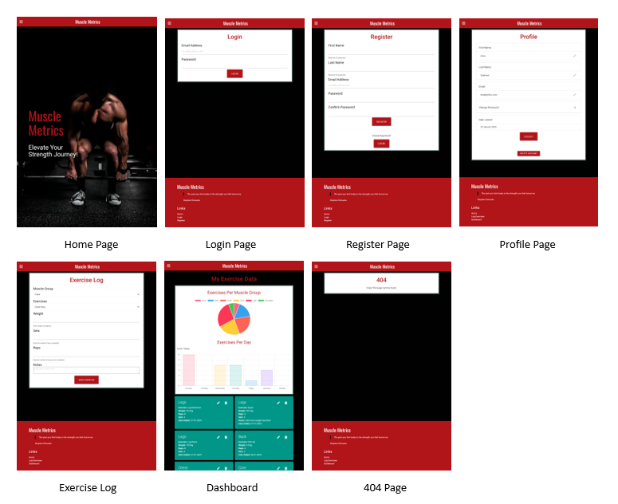

# Muscle Metrics - Testing

***
**Contents**
- [Muscle Metrics - Testing](#muscle-metrics---testing)
  - [Responsiveness](#responsiveness)
    - [Mobile Screenshots](#mobile-screenshots)
    - [Tablet Screenshots](#tablet-screenshots)
    - [Desktop Screenshots](#desktop-screenshots)
    - [Summary](#summary)
  - [Automated Testing](#automated-testing)
    - [Flask Testing](#flask-testing)
    - [W3C Validator](#w3c-validator)
    - [JSHint](#jshint)
    - [Python Linter](#python-linter)
    - [Validation Summary](#validation-summary)
    - [Lighthouse](#lighthouse)
    - [Wave](#wave)
  - [Browser Compatibility](#browser-compatibility)
  - [Manual Testing](#manual-testing)
    - [Testing User Stories](#testing-user-stories)
      - [New User](#new-user)
      - [Returning User](#returning-user)
    - [Full Testing](#full-testing)
      - [Interactive Elements](#interactive-elements)
  - [Bugs](#bugs)
    - [Solved Bugs](#solved-bugs)

***
## Responsiveness
This website has been tested on a wide range of screen sizes from various manufacturers to account for the differences between them. It’s crucial to test website responsiveness due to the web being mostly accessed using mobile devices. A responsive website guarantees a uniform user experience across different screen sizes and resolutions, making it easy for visitors to access and navigate the site, regardless of the device they’re using. Additionally, responsive design enhances search engine optimization (SEO), as search engines prioritize mobile-friendly sites in their rankings. The testing has been carried out using the device list on the chrome developer tools.

The resolutions tested as as follows:                        
Galaxy S III: 360 x 640                               
Iphone SE: 375 x 667                                  
Iphone 12 Pro: 390 x 844                           
Moto G Power: 412 x 823                                                             
Ipad Air: 768 x 1024                                                                
Nexus 10: 800 x 1280                                                                
Desktop 1080p: 1920 x 1080   

### Mobile Screenshots
           
### Tablet Screenshots
    
### Desktop Screenshots
            
            
           
        
### Summary
                 

***
## Automated Testing
### Flask Testing
Flask unit testing has been used to validate the proper rendering of templates and ensure the receipt of a 200 response for the home, login, and register pages. This testing process ensures the accurate functionality and user experience of these essential website pages.

### W3C Validator
Testing has been completed using the W3C code validators to ensure that the code used is clean, consistent and adheres to best practices. No warnings or errors were found and the results can be found below. The W3C Markup Validation Service is unable to validate the profile page as it contains content that is only accessible after logging in.          

1. [Home Page Validation](resources/validation/home%20_page.PNG)    
2. [Login Page Validation](resources/validation/login.PNG)                
3. [Registration Page Validation](resources/validation/register.PNG)             
4. [Exercise Log Validation](resources/validation/log_exercise.PNG)            
5. [Dashboard Validation](resources/validation/dashboard.PNG)                                    
6. [Profile Page](resources/validation/profile.PNG) *(Profile Page could not be validated)*                                
7. [CSS Validation](resources/validation/css.PNG)

### JSHint   
Quality testing of the JavaScript code has been carried out using [JSHint](https://jshint.com/). Before testing please ensure the checkboxes next to "New JavaScript features (ES6)" and "jQuery" have been turned on. To do this please click "CONFIGURE" and if needed click "New JavaScript features (ES6)" and "jQuery".                             

**_script.js_**    

### Python Linter      
The Code Institute Python Linter has been used to validate the python code. No errors were found and the results can be seen by clicking the links below.        

1. [muscle_metrics/app.py](resources/validation/python_linter/app.PNG)      
2. [muscle_metrics/env.template.py](resources/validation/python_linter/env_template.PNG)
3. [muscle_metrics/routes.py](resources/validation/python_linter/routes.PNG)        
4. [muscle_metrics/seed_data.py](resources/validation/python_linter/seed_data.PNG)     
5. [muscle_metrics/init.py](resources/validation/python_linter/init.PNG)
6. [register/routes.py](resources/validation/python_linter/register_routes.PNG)     
7. [register/forms/registration.py](resources/validation/python_linter/registration_form.PNG)
8. [register/forms/init.py](resources/validation/python_linter/registration_form_init.PNG)
9. [profile/routes.py](resources/validation/python_linter/profile_routes.PNG)
10. [profile/forms/init.py](resources/validation/python_linter/profile_forms_init.PNG)
11. [profile/forms/change_password.py](resources/validation/python_linter/change_password.PNG)
12. [profile/forms/edit_email.py](resources/validation/python_linter/edit_email.PNG)
13. [profile/forms/edit_first_name.py](resources/validation/python_linter/edit_first_name.PNG)
14. [profile/forms/edit_last_name.py](resources/validation/python_linter/edit_last_name.PNG)
15. [models/users.py](resources/validation/python_linter/users.PNG)
16. [models/progress.py](resources/validation/python_linter/progress.PNG)
17. [models/muscle_groups.py](resources/validation/python_linter/muscle_group.PNG)
18. [models/exercises.py](resources/validation/python_linter/exercises.PNG)
19. [models/init,py](resources/validation//python_linter/models_init.PNG)
20. [login/routes.py](resources/validation/python_linter/login_routes.PNG)
21. [login/forms/login.py](resources/validation//python_linter/login.PNG)
22. [login/forms/init.py](resources/validation//python_linter/login_forms_init.PNG)
23. [home/routes.py](resources/validation/python_linter/home_routes.PNG)
24. [exercise_log/routes.py](resources/validation/python_linter/exercise_log_routes.PNG)
25. [exercise_log/forms/log.py](resources/validation/python_linter/exercise_log_forms_log.PNG)
26. [exercise_log/forms/init.py](resources/validation/python_linter/exercise_log_forms_init.PNG)
27. [dashboard/routes.py](resources/validation/python_linter/dashboard_routes.PNG)

### Validation Summary

***
### Lighthouse
The lighthouse results can be found for each page below.    

   
***
### Wave
The Wave tool identified issues with color contrast and the use of Font Awesome icons without associated text; these errors have been addressed, fixed and are documented in the Bugs section.

[Homepage](resources/validation/wave_tool/homepage.PNG)         
[Login Page](resources/validation/wave_tool/login.PNG)           
[Registration Page](resources/validation/wave_tool/register.PNG)     
[Profile Page](resources/validation/wave_tool/profile.PNG)        
[Exercise Log](resources/validation/wave_tool/exercise_log.PNG)          
[Dashboard](resources/validation/wave_tool/dashboard.PNG)

***
## Browser Compatibility
Testing has been carried out on the browsers within the below table as these browsers are most used, but in addition to this Firefox uses Gecko rendering engine while the others use WebKit. This helps identify any inconsistencies or rendering discrepancies that may arise due to variations in the rendering engines.        

***
## Manual Testing
### Testing User Stories
#### New User
| Goals | How they are achieved | Reference |
| :-----| :--------------------:| :-------: |
|I would like to be able to easily record my weightlifting achievements, so that I can see a comprehensive display of my personal records and feel a sense of progress and accomplishment.| The exercise log has drop down menus to easily select muscle groups and exercises along with input fields to record weight, sets, reps and notes. | _Please see the exercise log image below._|
| I would like an intuitive way to visualize my strength training journey, so that I can monitor my progress over time through charts that reflect my workout history. | After recording the exercise in the exercise log the user can view this information in the dashboard along with graphs for visualization. | _Please see the dashboard image below._ |
| I would like full control over my exercise records with the ability to create, read, update, and delete entries, so I can manage my fitness data effectively. | The website uses CRUD functionality. A user can create an exercise in the exercise log and then read, edit and delete the exercise in the dashboard. | _Please see both the exercise log image and the dashboard below._ |
| I would like a secure login system for my fitness app, so that I can be assured my personal fitness data remains private and secure. | The user is required to register and login in order to use the website. The website uses flask login functionality supplied from the flask framework which ensures the security of the login process and it is also used to display only the current users information. | _Please see the register and login images below._ |
|I would like a mobile-friendly interface for my fitness app that adapts to various devices, allowing me to log workouts whether I’m at home or on-the-go. | The website is fully responsive and has been tested across types of display. | _Please see the responsiveness section of this document._ |

#### Returning User
| Goals | How they are achieved | Reference |
| :---- | :--------------------:| :-------: |
| I would like to see the number of completed exercises through updated charts each time I log in, allowing me to adjust my training program based on past performance and future goals. | Within the dashboard there is a pie chart to display the number of exercises completed by muscle group and bar graph showing the number of exercises completed per day over the last severn days. | _Please see the dashboard image below._ |
|I would like to efficiently enter and review my workout logs from previous sessions, ensuring consistency is maintained. | The workout logs from previous sessions can be viewed on the dashboard displaying all of the entered data. | _Please see the dashboard image below._ |
| I would like to access my dashboard quickly, utilizing the secure login system that protects my privacy. | The user can quickly log in using an email address and password and then select the dashboard from the nav bar. | _Please see the register and login images below._ |
|I would like seamless integration across my devices when using the fitness app, so I can transition from logging workouts on my phone to reviewing progress on my tablet or desktop without any inconvenience. | The website is fully responsive and has been tested across types of display. | _Please see the responsiveness section of this document._  |

***
### Full Testing
#### Interactive Elements
**Navbar**
| Feature | Expected Outcome | Testing Performed | Result | Pass/Fail |
| :-----: | :--------------: | :---------------: | :----: | :-------: |
| Logo | When clicked the user will be returned to the homepage. | Clicked on logo. | Returned to homepage. | Pass | 
| Homepage Link | When clicked the user will be returned to the homepage. | Clicked on home link. | Returned to homepage. | Pass |
| Login Link | When clicked the user will be taken to the login page. | Clicked on login link. | Taken to the login page. | Pass | 
| Register Link | When clicked the user will be taken to the register page. | Clicked on register link. | Taken to the register page. | Pass |
| Log exercises link | When clicked the user will be taken to the exercise log. | Clicked on log exercises link. | Taken to the exercise log. | Pass |
| Dashboard link | When clicked the user will be taken to the dashboard. | Clicked on dashboard link. | Taken to the dashboard. | Pass |
| Profile icon | When clicked the user will be taken to the profile page. | Clicked on profile icon. | Taken to the profile page. | Pass |

**Footer**
| Feature | Expected Outcome | Testing Performed | Result | Pass/Fail |
| :-----: | :--------------: | :---------------: | :----: | :-------: |
| Homepage Link | When clicked the user will be returned to the homepage. | Clicked on home link. | Returned to homepage. | Pass |
| Login Link | When clicked the user will be taken to the login page. | Clicked on login link. | Taken to the login page. | Pass | 
| Register Link | When clicked the user will be taken to the register page. | Clicked on register link. | Taken to the register page. | Pass |
| Log exercises link | When clicked the user will be taken to the exercise log. | Clicked on log exercises link. | Taken to the exercise log. | Pass |
| Dashboard link | When clicked the user will be taken to the dashboard. | Clicked on dashboard link. | Taken to the dashboard. | Pass |

**Homepage**
| Feature | Expected Outcome | Testing Performed | Result | Pass/Fail |
| :-----: | :--------------: | :---------------: | :----: | :-------: |
| Register now button | When clicked the user will be taken to the register page. | Clicked on the register now button. | Taken to the register page. | Pass |

**Login Page**
| Feature | Expected Outcome | Testing Performed | Result | Pass/Fail |
| :-----: | :--------------: | :---------------: | :----: | :-------: |
| Login Form | If email and password are valid the user will be logged in with a success macro shown. If not valid an error macro will be displayed asking the user to try again.  | Entered both invalid and valid credentials. | Error macro displayed when invalid and when valid credentials used the user was logged in and a success macro displayed. | Pass |

**Register Page**
| Feature | Expected Outcome | Testing Performed | Result | Pass/Fail |
| :-----: | :--------------: | :---------------: | :----: | :-------: |
| When all required fields are completed, validated and the user clicks register, the user will the be registered. | The user is registered and assigned a UUID. The user will be redirected to the login page. | Entered all fields and clicked register. | Registration was complete with a UUID being assigned in the database. Redirected to login page. | Pass |
| When the fields are not validated an error message will be displayed. | Error messages will not be displayed and the user will not be registered. | Entered information that could not be validated and fields were left blank. | Error messages were displayed and the user was not registered. | Pass |
| Login button | When clicked the user will be taken to the login page. | Clicked on login button. |  Taken to the login page. | Pass | 

**Log Exercises**
| Feature | Expected Outcome | Testing Performed | Result | Pass/Fail |
| :-----: | :--------------: | :---------------: | :----: | :-------: |
| When a muscle group is selected the appropriate set of exercises will be shown in the exercises dropdown. | Exercises related to the selected muscle group can only be selected. | Clicked on each muscle group. | Only the related exercises can be selected in the exercises dropdown. | Pass |
| When all required fields are completed, validated and the user clicks add exercise, the users exercise will be added to the dashboard and a success message displayed. | The exercise is added to the dashboard displaying the entered information and a success message displayed. | Entered all fields and clicked add exercise. | The exercise was added to the dashboard displaying all entered information and a success message displayed. | Pass |
| When fields are not validated. | Error messages will not be displayed and the exercise is not added. | Entered information that could not be validated and fields were left blank. | Error messages were displayed and the exercise was not added. | Pass |

**Dashboard**
| Feature | Expected Outcome | Testing Performed | Result | Pass/Fail |
| :-----: | :--------------: | :---------------: | :----: | :-------: |
| When an exercise is added the charts are automatically updated. | Charts update automatically. | Added an exercise. | The charts updated automatically. | Pass |
| Edit icon | Exercise log displayed with the exercise data pre populated ready for editing. | Clicked on edit icon. | The exercise log displays with the exercise data pre populated. | Pass |
| Save exercise button | When edits have been made, validated and the save exercise button has been clicked the data within the corresponding exercise on the dashboard will be updated and a success message displayed. | Edits made and save exercise button clicked. | The data has been updated on the dashboard and a success message was displayed. | Pass |
| Delete icon | When the delete icon is clicked the exercise will be deleted from the dashboard and a success message displayed. The charts will also be amended.  | Clicked the delete icon. | The exercise was deleted and the success message displayed. The charts also reflected the change. | Pass |

**Profile Page**
| Feature | Expected Outcome | Testing Performed | Result | Pass/Fail |
| :-----: | :--------------: | :---------------: | :----: | :-------: |
| Edit icon | When click a modal will be displayed with a form to edit the data. | Click on all edit icons. | All modals were displayed correctly. | Pass |
| Cancel buttons within modals | When clicked the modal will be dismissed and no changes made. | Clicked cancel buttons on all modals. | Modals were dismissed and no changes to the user data were made. | Pass |
| Submit button within modals | Once the user has made a change which has been validated the submit button will submit the change to the database and the profile page displayed with the data updated. A success message will be displayed. | Made changes and clicked on submit button in all modals. | All changes were made and all success messages displayed. | Pass |
| Logout button | When clicked the user will be logged out and redirected to the homepage. | Logout button clicked. | User logged out and redirected to homepage. | Pass |
| Delete account button | When clicked a modal will be displayed to gain confirmation of account deletion. | Clicked delete account button. | Modal was displayed. | Pass |
| Modal delete account button | When clicked the user will be deleted. | Clicked on delete account button. | User account deleted. | Pass |

**Macros**
| Feature | Expected Outcome | Testing Performed | Result | Pass/Fail |
| :-----: | :--------------: | :---------------: | :----: | :-------: |
| Dismissal `X` | When clicked the macro will be dismissed. | `X` clicked within macros. | Macros were dismissed. | Pass |
***
## Bugs
### Solved Bugs
| Bug | Solution |
|:----| :------: |
| During testing with the wave tool, an error was identified where the icons were missing text. | The solution involved converting these icons into buttons and adding a span element with the 'sr-only' class. This was done to include appropriate text for each icon. |
| The wave tool detected contrast issues involving red headings on black backgrounds and teal exercise card elements. | To address this, I brightened the red for the headings and darkened the teal in the exercise cards.|