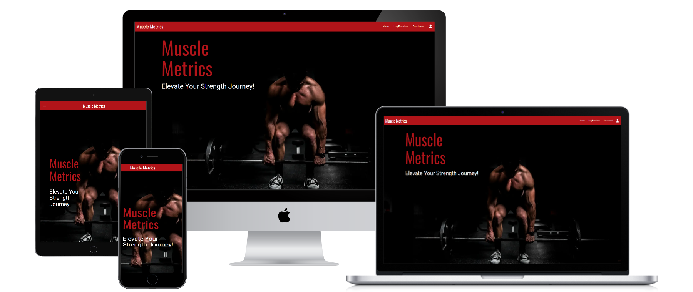

# Muscle Metrics - Testing

***
**Contents**
- [Muscle Metrics - Testing](#muscle-metrics---testing)
  - [Responsiveness](#responsiveness)
    - [Mobile Screenshots](#mobile-screenshots)
    - [Tablet Screenshots](#tablet-screenshots)
    - [Desktop Screenshots](#desktop-screenshots)
    - [Summary](#summary)
  - [Automated Testing](#automated-testing)
    - [W3C Validator](#w3c-validator)

***
## Responsiveness
This website has been tested on a wide range of screen sizes from various manufacturers to account for the differences between them. It’s crucial to test website responsiveness due to the web being mostly accessed using mobile devices. A responsive website guarantees a uniform user experience across different screen sizes and resolutions, making it easy for visitors to access and navigate the site, regardless of the device they’re using. Additionally, responsive design enhances search engine optimization (SEO), as search engines prioritize mobile-friendly sites in their rankings. The testing has been carried out using the device list on the chrome developer tools.

The resolutions tested as as follows:                        
Galaxy S III: 360 x 640                               
Iphone SE: 375 x 667                                  
Iphone 12 Pro: 390 x 844                           
Moto G Power: 412 x 823                                                             
Ipad Air: 768 x 1024                                                                
Nexus 10: 800 x 1280                                                                
Desktop 1080p: 1920 x 1080   

### Mobile Screenshots
           
### Tablet Screenshots
    
### Desktop Screenshots
            
            
           
        
### Summary
                 

***
## Automated Testing

### W3C Validator
Testing has been completed using the W3C code validators to ensure that the code used is clean, consistent and adheres to best practices. No warnings or error were found and the results can be found below.           
